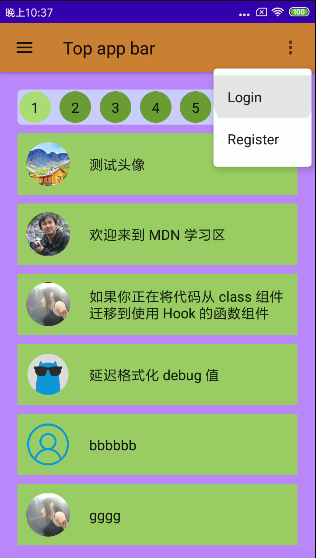
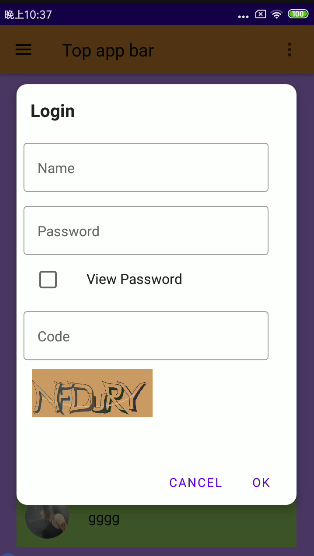

# purebbs-compose

Android client of PureBBS by Compose

  
  

This project is still under construction.

repos:
- [web-react](https://github.com/maxyou/purebbs)
- [server-nodejs](https://github.com/maxyou/purebbs-server)
- [android-jetpack](https://github.com/maxyou/purebbs-android)
- [android-compose](https://github.com/maxyou/purebbs-compose)
- [client-react-native](https://github.com/maxyou/purebbs-react-native)

## License 
under [MIT License](http://www.opensource.org/licenses/MIT).

